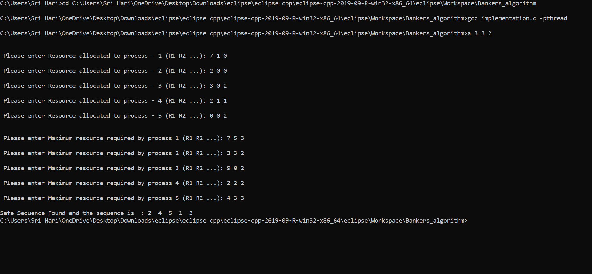

# Bankers Algorithm
Bankers algorithm is a resource allocation and deadlock avoidance algorithm 
developed by Edsger Dijkstra that tests for safety by simulating the allocation of predetermined 
maximum possible amounts of all resources, and then makes a "s-state" check to test for possible 
deadlock conditions for all other pending activities, before deciding whether allocation should 
be allowed to continue

## Application

## Hill Statement
 **Who** : A Bank Worker 
 
 **What** : Can check whether it is safe to give money or not
 
 **Wow** : In considerably lower time than traditional way of finding out
 
 ## Architecture Diagram

## Abstract

The algorithm was developed in the design process for the operating system and
originally described (in Dutch) in EWD108. The name is by analogy with the way that bankers
account for liquidity constraints.

The Banker's algorithm is run by the operating system whenever a process requests
resource. The algorithm avoids deadlock by denying or postponing the request if it determines
that accepting the request could put the system in an unsafe state (one where deadlock could
occur). When a new process enters a system, it must declare the maximum number of instances
of each resource type that may not exceed the total number of resources in the system. Also,
when a process gets all its requested resources it must return them in a finite amount of time.

For the Banker's algorithm to work, it needs to know three things:

a. How much of each resource each process could possibly request?
b. How much of each resource each process is currently holding?
c. How much of each resource the system currently has available?

Resources may be allocated to a process only if it satisfies the following conditions:

a. Request ≤ max, else set error condition as process has crossed maximum claim made by
it.
b. Request ≤ available, else process waits until resources are available.
Some of the resources that are tracked in real systems are memory, semaphores and interface
access. It derives its name from the fact that this algorithm could be used in a banking system to
ensure that the bank does not run out of resources, because the bank would never allocate its
money in such a way that it can no longer satisfy the needs of all its customers. By using this
algorithm, the bank ensures that when customers request money the bank never leaves a safe
state. If the customer's request does not cause the bank to leave a safe state, the cash will be
allocated; otherwise the customer must wait until some other customer deposits enough.

## Outputs

## Technology stack
**Programming languages & Libraries**: C,C++

## Contributors

D Venkata Sai Sri Hari

Rakshita Sathyakumar
